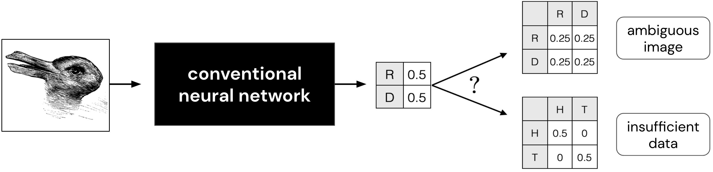
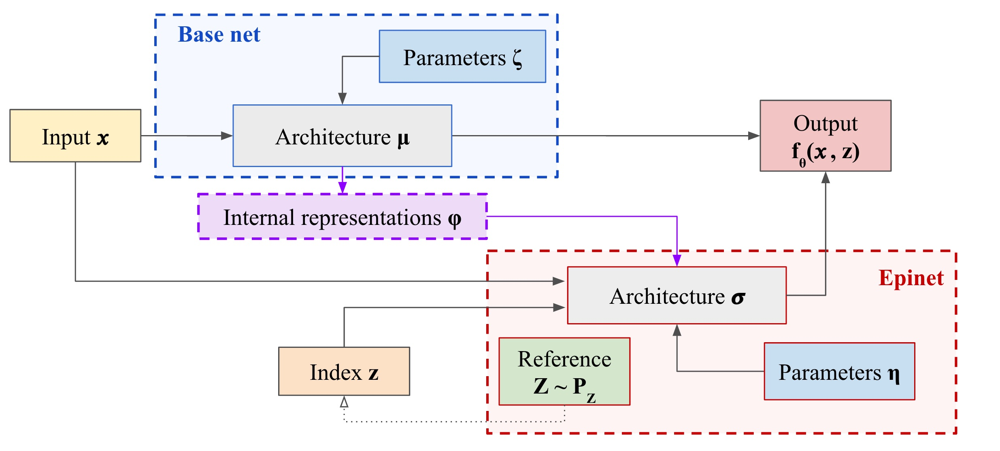

# Epistemic Neural Networks

> A library for neural networks that know what they don't know.

For background information, please see the [paper]

## Introduction

Conventional neural networks generate *marginal* predictions: given one input, they predict one label.
If a neural network outputs probability 50:50 it remains unclear if that is because of genuine ambiguity in the input, or just because the neural network has insufficient training data.
These two possibilities would be distinguished by *joint* predictions: given multiple inputs, predict multiple labels.




An epistemic neural network (ENN) makes predictions given a single input `x`, but also an epistemic index `z`.
The ENN controls the index `z` and uses it to produce joint predictions over multiple inputs `x_1,..,x_t` which may be different from just the product of marginals.


An ENN provides a general interface for thinking about uncertainty estimation in deep learning.
Note that, all existing approaches to uncertainty modeling, such as Bayesian neural networks (BNNs), can be expressed as ENNs.
However, there are ENN architectures that are not natural to express and BNNs.
This library provides interfaces and tools for the design and training of ENNs.


## Technical overview

> The `enn` library provides a lightweight interface for ENNs implemented on top of [JAX](https://github.com/google/jax) and [Haiku](https://github.com/deepmind/dm-haiku).
If you want to use our `enn` library, we highly recommend you start by familiarizing yourself with these libraries first.


We outline the key high-level interfaces for our code in [base.py](enn/base.py):

- `EpistemicNetwork`: a convenient pairing of Haiku transformed + index sampler.
  - `apply`: haiku-style apply function taking `params, x, z -> f_params(x,z)``
  - `init`: haiku-style init function taking `key, x, z -> params_init`
  - `indexer`: generates a sample from the reference index distribution taking `key -> z`.
- `LossFn`: Given an ENN, parameters, and data: how to compute a loss.
  - Takes: `enn, params, batch, key`
  - Outputs: `loss, metrics`

We then use these high-level concepts to build and train ENNs.


## Getting started

You can get started in our [colab tutorial] without installing anything on your
machine.


### Installation

We have tested `ENN` on Python 3.7. To install the dependencies:

1.  **Optional**: We recommend using a
    [Python virtual environment](https://docs.python.org/3/tutorial/venv.html)
    to manage your dependencies, so as not to clobber your system installation:

    ```bash
    python3 -m venv enn
    source enn/bin/activate
    pip install --upgrade pip setuptools
    ```

2.  Install `ENN` directly from [github](https://github.com/deepmind/enn):

    ```bash
    pip install git+https://github.com/deepmind/enn
    ```
3.  Test that you can load `ENN` by training a simple ensemble ENN.

    ```python
    from acme.utils.loggers.terminal import TerminalLogger

    from enn import losses
    from enn import networks
    from enn import supervised
    from enn.supervised import regression_data
    import optax

    # A small dummy dataset
    dataset = regression_data.make_dataset()

    # Logger
    logger = TerminalLogger('supervised_regression')

    # ENN
    enn = networks.MLPEnsembleMatchedPrior(
        output_sizes=[50, 50, 1],
        num_ensemble=10,
    )

    # Loss
    loss_fn = losses.average_single_index_loss(
        single_loss=losses.L2LossWithBootstrap(),
        num_index_samples=10
    )

    # Optimizer
    optimizer = optax.adam(1e-3)

    # Train the experiment
    experiment = supervised.Experiment(
        enn, loss_fn, optimizer, dataset, seed=0, logger=logger)
    experiment.train(FLAGS.num_batch)
    ```

4. **Optional**: run the tests by executing `./test.sh` from ENN root directory.


## Epinet

One of the key contributions of our [paper] is the *epinet*: a new ENN architecture that can supplement any conventional NN and be trained to estimate uncertainty.


An epinet is a neural network with privileged access to inputs and outputs of activation units in the base network.
A subset of these inputs and outputs, denoted by $$\phi_\zeta(x)$$, are taken as input to the epinet along with an epistemic index $$z$$.
For epinet parameters $$\eta$$, the epinet outputs $$\sigma_\eta(\phi_\zeta(x), z)$$.
To produce an ENN, the output of the epinet is added to that of the base network, though with a "stop gradient":

$$ \underbrace{f_\theta(x, z)}_{\text{ENN}} = \underbrace{\mu_\zeta(x)}_{\text{base net}} + \underbrace{\sigma_\eta(\mathrm{sg}[\phi_\zeta(x)], z)}_{\text{epinet}}. $$

We can visualize this network architecture:



As part of our release include an [epinet colab] that loads in a pre-trained base network and epinet on ImageNet.
The core network logic for epinet is available in [networks/epinet](enn/networks/epinet/README.md).


## Citing

If you use `ENN` in your work, please cite the accompanying [paper]:

```bibtex
@article{osband2022epistemic,
  title={Epistemic neural networks},
  author={Osband, Ian and Wen, Zheng and Asghari, Seyed Mohammad and Dwaracherla, Vikranth and Ibrahimi, Morteza and Lu, Xiuyuan and Van Roy, Benjamin},
  journal={arXiv preprint arXiv:2107.08924},
  year={2022}
}
```

[colab tutorial]: https://colab.research.google.com/github/deepmind/enn/blob/master/enn/colabs/enn_demo.ipynb
[epinet colab]: https://colab.research.google.com/github/deepmind/enn/blob/master/enn/colabs/enn_demo.ipynb
[paper]: https://arxiv.org/abs/2107.08924
